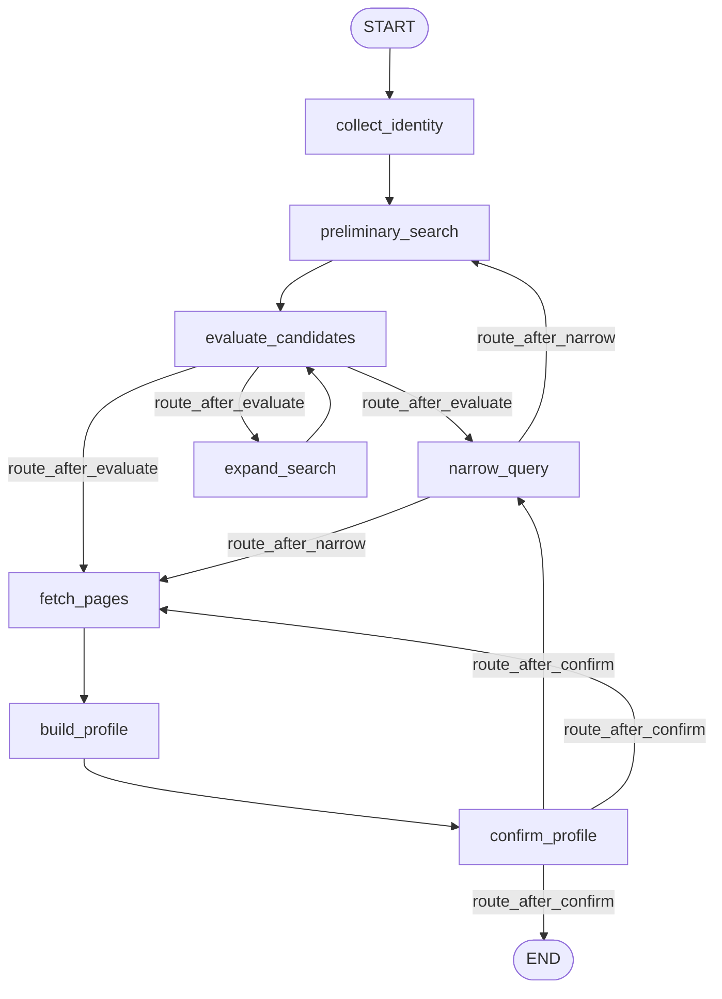

# DEV — разработка search4people_v2

Документ для разработчиков: как запускать оценки качества LLM (DeepEval) и как
безопасно менять граф LangGraph.

## Содержание
- [Тесты и оценки](#тесты-и-оценки)
  - [Быстрый набор](#быстрый-набор)
  - [Оценки качества через DeepEval](#оценки-качества-через-deepeval)
- [Как менять граф](#как-менять-граф)

---

## Тесты и оценки

### Быстрый набор

Обычный прогон — детерминированный, без сети и без LLM (всё замокано):

```bash
uv run pytest
```

В `pyproject.toml` стоит `addopts = -ra --strict-markers -m "not eval"`, поэтому
тяжёлые DeepEval-тесты по умолчанию **не запускаются**.

### Оценки качества через DeepEval

DeepEval-тесты оценивают качество выводов LLM-узлов графа с помощью
LLM-as-judge. Это медленно (минуты на тест на локальной модели) и
недетерминированно, поэтому они opt-in.

**Судья по умолчанию — локальный.** Судья ходит через тот же провайдер, что и
приложение (`tests/evals/judge.py` → `app/llm.py` → `Settings`). По умолчанию
(`.env.example`) это **Ollama + `gpt-oss`**, то есть оценки идут локально и
бесплатно — API-ключи не нужны. Требуется лишь запущенный Ollama с нужной
моделью:

```bash
ollama serve              # если ещё не запущен
ollama pull gpt-oss:20b   # модель из .env (LLM_MODEL)
```

**Запуск оценок (кроме живого e2e):**

```bash
uv run pytest -m "eval and not live"
```

**Запуск конкретной группы:**

```bash
uv run pytest tests/evals/test_extract_faithfulness.py -m eval -v
```

**Живой end-to-end smoke** (ходит в реальный веб-поиск/страницы, флапает):

```bash
uv run pytest -m "eval and live"
```

**Если судья недоступен** (выбран cloud-провайдер без ключа, либо Ollama не
поднят) — eval-тесты **скипаются**, а не падают (см. `tests/evals/conftest.py`,
фикстура `_require_judge`).

**Сменить судью на более сильную модель** (например, для разовой строгой
проверки) — через переменные окружения / `.env`:

```bash
LLM_PROVIDER=anthropic LLM_MODEL=claude-sonnet-4-6 ANTHROPIC_API_KEY=... \
  uv run pytest -m "eval and not live"
```

#### Структура `tests/evals/`

| Файл | Что проверяет |
|------|---------------|
| `judge.py` | `LangChainJudge` — обёртка `app/llm.py` под интерфейс DeepEval |
| `conftest.py` | таймаут-оверрайды + отключение телеметрии + автоскип при недоступном судье |
| `data/pages/*.md` | сохранённые страницы — входы и `retrieval_context` |
| `data/candidates/*.json` | фиксированные списки кандидатов |
| `data/goldens.json` | ожидаемые и запрещённые факты |
| `test_extract_faithfulness.py` | extract не выдумывает факты (`FaithfulnessMetric` + `GEval`) и отклоняет чужую страницу (детерминированно) |
| `test_build_profile_quality.py` | слияние partials в валидный, подкреплённый профиль (`GEval`) |
| `test_narrow_query_quality.py` | уточняющий вопрос ясен и различает кандидатов (`GEval`) |
| `test_e2e_relevance.py` | живой прогон графа про нужного человека (`live`) |

#### Как это устроено

1. Тест читает голден-вход (страницу/список кандидатов) из `data/`.
2. Вызывает **реальный** LLM-узел приложения (`extract_profile_from_page`,
   `build_profile`, `plan_narrowing`) — оценивается фактический промпт + модель.
3. Оборачивает результат в `LLMTestCase` (`actual_output`, плюс
   `retrieval_context`/`context` = исходная страница).
4. `assert_test(test_case, [metric, ...])` — метрики с судьёй `LangChainJudge`
   ставят оценку; тест падает, если порог не достигнут.

#### Пороги и направление метрик

Пороги консервативны (0.5–0.6), т.к. локальный `gpt-oss` слабее облачных
моделей. Семантика разная:

- `FaithfulnessMetric`, `GEval` — **выше лучше** (success при `score >= threshold`).
- `HallucinationMetric` — **ниже лучше** (success при `score <= threshold`).

Падение метрики печатает `reason` — читайте его, прежде чем менять промпт или
порог.

#### Сериализация и таймауты (важно для локальных моделей)

Локальная Ollama обслуживает запросы по одному. Поэтому метрики запускаются
**последовательно**: у метрик стоит `async_mode=False`, а у `assert_test` —
`run_async=False`. Это убирает гонку параллельных запросов к одной модели.
Таймауты DeepEval подняты в `conftest.py`
(`DEEPEVAL_PER_TASK_TIMEOUT_SECONDS_OVERRIDE`,
`DEEPEVAL_TASK_GATHER_BUFFER_SECONDS_OVERRIDE` = 1200s).

#### Известный флак: structured output на gpt-oss

Иногда Ollama на `gpt-oss` возвращает `failed to load model vocabulary required
for format` при JSON-schema запросе. Приложение это переживает (логирует и
отдаёт профиль с `confidence="low"`), а тест `build_profile` делает ограниченный
ретрай и при стойком повторе **скипается** — это инфраструктурный флак, а не
регрессия качества. `extract`-faithfulness устойчив: пустой профиль тривиально
«верен» источнику.

> Замечание: в `test_extract_faithfulness.py` оставлены `FaithfulnessMetric` +
> `GEval(NoFabrication)`; `HallucinationMetric` убран из ассерта ради времени
> прогона на локальной модели (он во многом дублирует Faithfulness). При запуске
> на быстром облачном судье его можно вернуть.

#### Добавить новый голден

1. Положите Markdown страницы в `tests/evals/data/pages/<name>.md`.
2. Добавьте запись в `tests/evals/data/goldens.json` (`full_name`, `url`,
   `expected_facts`, `forbidden_facts`).
3. Допишите тест-кейс (или параметризуйте существующий), прогоните
   `uv run pytest -m "eval and not live" -v`.

#### Стоимость и приватность

Телеметрия DeepEval отключена (`DEEPEVAL_TELEMETRY_OPT_OUT=1` в
`tests/evals/conftest.py`); облако Confident AI не используется. На дефолтном
локальном судье оценки бесплатны.

---

## Как менять граф

Граф — это конечный автомат LangGraph поверх `PeopleSearchState`. Четыре места:

| Файл | Ответственность |
|------|-----------------|
| `app/models/state.py` | `PeopleSearchState` (TypedDict) и `Phase` — поля состояния |
| `app/graph/nodes.py` | реализации узлов (`async def …(state) -> dict`) и роутеры (`route_*`) |
| `app/graph/build.py` | сборка: `add_node`, `add_edge`, `add_conditional_edges` |
| `app/graph/prompts.py` | промпты, используемые узлами |

### Текущая топология



Узлы возвращают **частичный** патч state (dict с изменёнными ключами), а не весь
state. Маршрутизация вынесена в чистые функции `route_*`, которые читают
`state["phase"]` и возвращают имя следующего узла.

### Рецепт: добавить узел

1. **State (если нужно новое поле):** добавьте ключ в `PeopleSearchState`
   (`app/models/state.py`). Помните: значения должны быть msgpack-сериализуемы
   для SQLite-чекпойнтера — храните dict'ы, а не pydantic-модели.
2. **Узел:** в `app/graph/nodes.py`:

   ```python
   async def my_node(state: PeopleSearchState) -> dict[str, Any]:
       # ... работа ...
       return {"phase": "next_phase", "some_field": value}
   ```

3. **Регистрация:** в `app/graph/build.py` импортируйте узел и добавьте:

   ```python
   graph.add_node("my_node", my_node)
   graph.add_edge("previous_node", "my_node")
   graph.add_edge("my_node", "next_node")
   ```

4. **Тесты:** обновите `tests/test_graph_flow.py` (ожидаемый список посещённых
   узлов) и, при необходимости, eval-тесты.

### Рецепт: условное ребро (роутер)

1. Узел-источник проставляет `state["phase"]`.
2. Чистая функция-роутер:

   ```python
   def route_after_my_node(state: PeopleSearchState) -> str:
       if state.get("phase") == "x":
           return "node_x"
       return "node_y"
   ```

3. Связывание с **явной картой** меток на имена узлов:

   ```python
   graph.add_conditional_edges(
       "my_node",
       route_after_my_node,
       {"node_x": "node_x", "node_y": "node_y", "__end__": END},
   )
   ```

### Рецепт: изменить маршрутизацию

Меняйте только тело соответствующей `route_*` и карту в
`add_conditional_edges`. Поведение узлов не трогайте — так диффы остаются
локальными и тестируемыми.

### Рецепт: пауза на пользователя (`interrupt`)

Внутри узла:

```python
answer = interrupt({"kind": "ask_something", "locale": state.get("locale", "en")})
```

Граф приостановится; UI-слой (Chainlit) возобновляет его через
`Command(resume=<payload>)`. Контракт payload ↔ resume держите рядом с узлом.
Если LLM-часть узла нужно оценивать через DeepEval — **выносите её в чистый
хелпер** (как `plan_narrowing`), чтобы её можно было вызвать без `interrupt`.

### Чек-лист после изменения графа

- [ ] `uv run pytest` — быстрый набор зелёный (обновите `tests/test_graph_flow.py`).
- [ ] Обновите Mermaid-диаграмму выше, если изменилась топология.
- [ ] Если затронули LLM-узлы — прогоните `uv run pytest -m "eval and not live"`.
- [ ] `uv run ruff check .` и `uv run mypy app` — без новых ошибок.
