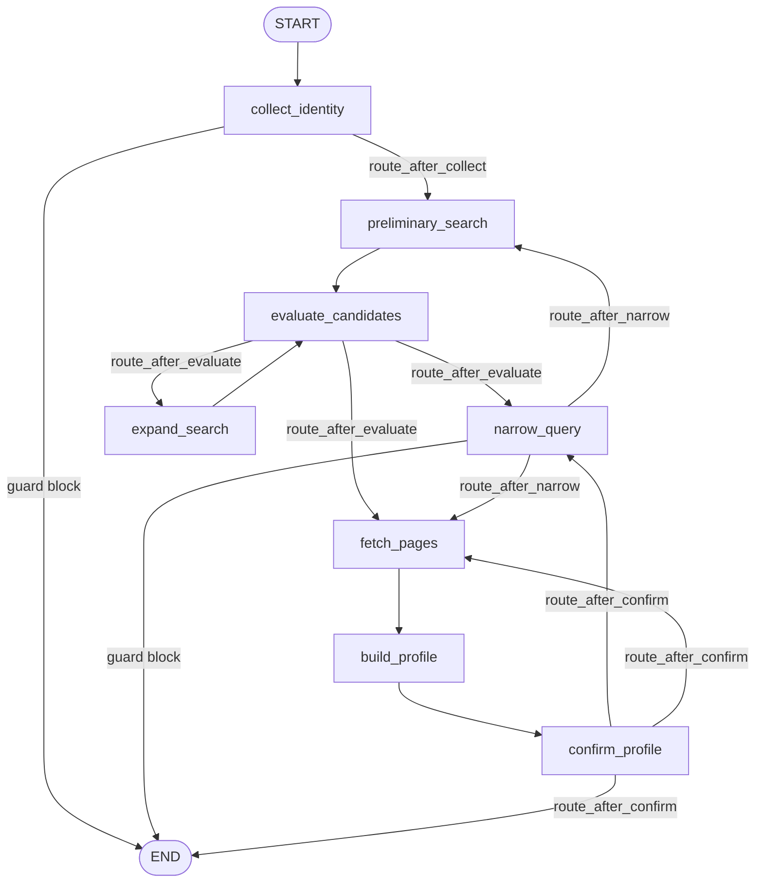

# DEV — developing search4people_v2

A developer guide: how to run the LLM quality evaluations (DeepEval) and how to
change the LangGraph graph safely.

## Contents
- [Tests and evaluations](#tests-and-evaluations)
  - [Quick suite](#quick-suite)
  - [Quality evaluations via DeepEval](#quality-evaluations-via-deepeval)
- [Changing the graph](#changing-the-graph)

---

## Tests and evaluations

### Quick suite

The normal run is deterministic, with no network and no LLM (everything mocked):

```bash
uv run pytest
```

`pyproject.toml` sets `addopts = -ra --strict-markers -m "not eval and not models"`,
so the heavy DeepEval tests and the real-weight guardrail tests do **not** run by
default.

### Quality evaluations via DeepEval

The DeepEval tests assess the output quality of the graph's LLM nodes using an
LLM-as-judge. This is slow (minutes per test on a local model) and
non-deterministic, so they are opt-in.

**The judge is local by default.** It goes through the same provider as the
application (`tests/evals/judge.py` → `app/llm.py` → `Settings`). By default
(`.env.example`) that is **Ollama + `gpt-oss`**, so the evals run locally and for
free — no API keys needed. You only need a running Ollama with the right model:

```bash
ollama serve              # if not already running
ollama pull gpt-oss:20b   # the model from .env (LLM_MODEL)
```

**Run the evals (excluding the live e2e):**

```bash
uv run pytest -m "eval and not live"
```

**Run a specific group:**

```bash
uv run pytest tests/evals/test_extract_faithfulness.py -m eval -v
```

**Live end-to-end smoke** (hits real web search/pages, flaky):

```bash
uv run pytest -m "eval and live"
```

**If the judge is unavailable** (a cloud provider is selected without a key, or
Ollama is not up) the eval tests are **skipped**, not failed (see
`tests/evals/conftest.py`, the `_require_judge` fixture).

**Switch the judge to a stronger model** (e.g. for a one-off strict check) via
environment variables / `.env`:

```bash
LLM_PROVIDER=anthropic LLM_MODEL=claude-sonnet-4-6 ANTHROPIC_API_KEY=... \
  uv run pytest -m "eval and not live"
```

#### Layout of `tests/evals/`

| File | What it checks |
|------|----------------|
| `judge.py` | `LangChainJudge` — wraps `app/llm.py` to the DeepEval interface |
| `conftest.py` | timeout overrides + telemetry opt-out + auto-skip when the judge is unavailable |
| `data/pages/*.md` | saved pages — inputs and `retrieval_context` |
| `data/candidates/*.json` | fixed candidate lists |
| `data/goldens.json` | expected and forbidden facts |
| `test_extract_faithfulness.py` | extract does not fabricate facts (`FaithfulnessMetric` + `GEval`) and rejects an unrelated page (deterministic) |
| `test_build_profile_quality.py` | merging partials into a valid, evidence-backed profile (`GEval`) |
| `test_narrow_query_quality.py` | the clarifying question is clear and discriminates between candidates (`GEval`) |
| `test_e2e_relevance.py` | a live graph run for the intended person (`live`) |

#### How it works

1. The test reads a golden input (a page / candidate list) from `data/`.
2. It calls the application's **real** LLM node (`extract_profile_from_page`,
   `build_profile`, `plan_narrowing`) — the actual prompt + model are evaluated.
3. It wraps the result in an `LLMTestCase` (`actual_output`, plus
   `retrieval_context`/`context` = the source page).
4. `assert_test(test_case, [metric, ...])` — metrics judged by `LangChainJudge`
   score the case; the test fails if the threshold is not met.

#### Thresholds and metric direction

Thresholds are conservative (0.5–0.6) because the local `gpt-oss` is weaker than
cloud models. The semantics differ:

- `FaithfulnessMetric`, `GEval` — **higher is better** (success when `score >= threshold`).
- `HallucinationMetric` — **lower is better** (success when `score <= threshold`).

A failing metric prints its `reason` — read it before changing a prompt or a
threshold.

#### Serialization and timeouts (important for local models)

A local Ollama serves requests one at a time. So the metrics run
**sequentially**: metrics use `async_mode=False` and `assert_test` uses
`run_async=False`. This removes the race between parallel requests to a single
model. DeepEval timeouts are raised in `conftest.py`
(`DEEPEVAL_PER_TASK_TIMEOUT_SECONDS_OVERRIDE`,
`DEEPEVAL_TASK_GATHER_BUFFER_SECONDS_OVERRIDE` = 1200s).

#### Structured output on Ollama (important)

On this Ollama build the strict **`json_schema`** path (the `format=<schema>`
grammar) breaks for several models (both `gpt-oss:20b` and `qwen3.5`) with
`failed to load model vocabulary required for format`. So for the `ollama`
provider the application uses the **`function_calling`** method (the
`OLLAMA_STRUCTURED_OUTPUT_METHOD` setting, see
`app/llm.py::build_structured_model`) — it works around that error. Cloud
providers (anthropic/openai) use LangChain's default method.

Additionally `build_chat_model` keeps the model resident via `keep_alive`
(`OLLAMA_KEEP_ALIVE`, default `-1`) — this lowers cold-load latency, but is
**not** related to the error above.

**Quality depends on the model.** With `function_calling` the model must
carefully fill the nested `PersonProfile` schema (fields `organization`,
`platform`, `url`, the `Location` object, …). `qwen3.5` handles it — it returns a
valid profile; `gpt-oss:20b` often confuses field names (`company`/`type`/
`source`), the profile fails validation, and the app falls back to
`confidence="low"`. So for an eval run a model with good tool-calling is
recommended:

```bash
LLM_MODEL=qwen3.5:latest uv run pytest -m "eval and not live"
```

**Provenance does not depend on the LLM.** The merge step (`build_profile`)
deterministically carries `evidence` from the partial profiles into the final
one (`_merge_evidence`, deduped by URL): the merge model sometimes returns an
empty `evidence`, so sources are added in code, not at the LLM's discretion.

The judge is also a local model: weak models occasionally emit invalid JSON for
GEval (`Evaluation LLM outputted an invalid JSON`). For evals, use a stronger
model (`qwen3.5`/cloud) — see "Switch the judge" above.

If the model still returns an empty profile, the `build_profile` test does a
bounded retry and, on a persistent repeat, is **skipped** — that is an
infrastructure/model flake, not a regression. `extract`-faithfulness is robust: an
empty profile is trivially "faithful" to the source.

> Note: `test_extract_faithfulness.py` keeps `FaithfulnessMetric` +
> `GEval(NoFabrication)`; `HallucinationMetric` was dropped from the assertion to
> save run time on a local model (it largely duplicates Faithfulness). It can be
> restored when running against a fast cloud judge.

#### Add a new golden

1. Put the page Markdown in `tests/evals/data/pages/<name>.md`.
2. Add an entry to `tests/evals/data/goldens.json` (`full_name`, `url`,
   `expected_facts`, `forbidden_facts`).
3. Add a test case (or parametrize an existing one), then run
   `uv run pytest -m "eval and not live" -v`.

#### Cost and privacy

DeepEval telemetry is disabled (`DEEPEVAL_TELEMETRY_OPT_OUT=1` in
`tests/evals/conftest.py`); the Confident AI cloud is not used. On the default
local judge the evals are free.

---

## Changing the graph

The graph is a LangGraph state machine over `PeopleSearchState`. Four places:

| File | Responsibility |
|------|----------------|
| `app/models/state.py` | `PeopleSearchState` (TypedDict) and `Phase` — the state fields |
| `app/graph/nodes.py` | node implementations (`async def …(state) -> dict`) and routers (`route_*`) |
| `app/graph/build.py` | assembly: `add_node`, `add_edge`, `add_conditional_edges` |
| `app/graph/prompts.py` | the prompts used by the nodes |

### Current topology



Nodes return a **partial** state patch (a dict of changed keys), not the whole
state. Routing lives in pure `route_*` functions that read `state["phase"]` (and
`state["guard_block"]`) and return the next node's name.

### Guardrails in the graph

The guardrails layer (`app/guardrails/`, see `README.md`) is enforced inside the
nodes, so it covers both the Chainlit and A2A frontends at once:

- `collect_identity` / `narrow_query` call `get_guardrails().check_input(...)`. On
  a block they set `state["guard_block"]` and `phase="done"`; `route_after_collect`
  / `route_after_narrow` then route to `END`. Blocking is done via **state +
  routing, not `raise`**, so the checkpointer stays consistent.
- `fetch_pages` calls `scan_content(...)` on the fetched page before extraction.
- `build_profile` calls `redact_profile(...)` on the assembled profile.

When `GUARDRAILS_BACKEND=noop` (or `GUARDRAILS_ENABLED=false`) these calls return
allow/no-op verdicts, so the graph behaves exactly as before. Tests inject a
`FakeBackend` by monkeypatching `app.graph.nodes.get_guardrails`.

### Recipe: add a node

1. **State (if a new field is needed):** add the key to `PeopleSearchState`
   (`app/models/state.py`). Remember: values must be msgpack-serializable for the
   SQLite checkpointer — store dicts, not pydantic models.
2. **Node:** in `app/graph/nodes.py`:

   ```python
   async def my_node(state: PeopleSearchState) -> dict[str, Any]:
       # ... work ...
       return {"phase": "next_phase", "some_field": value}
   ```

3. **Registration:** in `app/graph/build.py` import the node and add:

   ```python
   graph.add_node("my_node", my_node)
   graph.add_edge("previous_node", "my_node")
   graph.add_edge("my_node", "next_node")
   ```

4. **Tests:** update `tests/test_graph_flow.py` (the expected list of visited
   nodes) and, if needed, the eval tests.

### Recipe: conditional edge (router)

1. The source node sets `state["phase"]`.
2. A pure router function:

   ```python
   def route_after_my_node(state: PeopleSearchState) -> str:
       if state.get("phase") == "x":
           return "node_x"
       return "node_y"
   ```

3. Wire it with an **explicit map** of labels to node names:

   ```python
   graph.add_conditional_edges(
       "my_node",
       route_after_my_node,
       {"node_x": "node_x", "node_y": "node_y", "__end__": END},
   )
   ```

### Recipe: change routing

Change only the body of the relevant `route_*` and the map in
`add_conditional_edges`. Don't touch node behavior — that keeps diffs local and
testable.

### Recipe: pause for the user (`interrupt`)

Inside a node:

```python
answer = interrupt({"kind": "ask_something", "locale": state.get("locale", "en")})
```

The graph pauses; the UI layer (Chainlit) resumes it via
`Command(resume=<payload>)`. Keep the payload ↔ resume contract next to the node.
If the LLM part of a node needs DeepEval evaluation — **extract it into a pure
helper** (like `plan_narrowing`) so it can be called without `interrupt`.

### Checklist after changing the graph

- [ ] `uv run pytest` — the quick suite is green (update `tests/test_graph_flow.py`).
- [ ] Update the Mermaid diagram above if the topology changed.
- [ ] If LLM nodes were touched — run `uv run pytest -m "eval and not live"`.
- [ ] `uv run ruff check .` and `uv run mypy app` — no new errors.
```

---

## Chat history (persistence)

The Chainlit frontend persists per-user conversations via Chainlit's
`SQLAlchemyDataLayer`, stored in a **separate** SQLite file
`data/chat_history.db` (`CHAT_HISTORY_DB_PATH`) — kept apart from `data/app.db`
because Chainlit's data-layer schema defines its own `users` table that would
collide with the auth `users` table.

- **Schema:** `app/db/chat_history_schema.sql`, applied idempotently with WAL by
  `app/db/chat_history.py::init_chat_history_db()`. It must declare **every**
  column `SQLAlchemyDataLayer` can write (Chainlit builds INSERTs dynamically and
  `execute_sql` *swallows* errors, so a missing column silently drops the
  step/element). `tests/test_chat_history_db.py` guards this by INSERTing every
  column `Step.to_dict()` emits (e.g. `steps.defaultOpen`/`autoCollapse`).
  Note: the schema uses `CREATE TABLE IF NOT EXISTS`, so it does **not** migrate
  an existing DB — after a schema change in development, delete
  `data/chat_history.db` to pick it up.
- **`thread_id`** is unified with Chainlit's `cl.context.session.thread_id`, so
  reopening a thread restores both the UI messages and the LangGraph checkpoint.

### "New Chat" and parallel use

`confirm_new_chat = false` in `.chainlit/config.toml`. With the data layer on,
**"New Chat" is non-destructive** — it opens a new persisted thread and the
previous conversation stays in the history sidebar — so the old confirmation
dialog ("history will be cleared") was misleading and is disabled.

Chainlit runs **one message handler per session (browser tab)**; there is no
true multi-run concurrency within a single tab. For parallel searches, open
**multiple tabs** — each gets its own thread and checkpoint and runs
independently. Switching threads in one tab via the sidebar preserves each
thread's state in its checkpoint.
