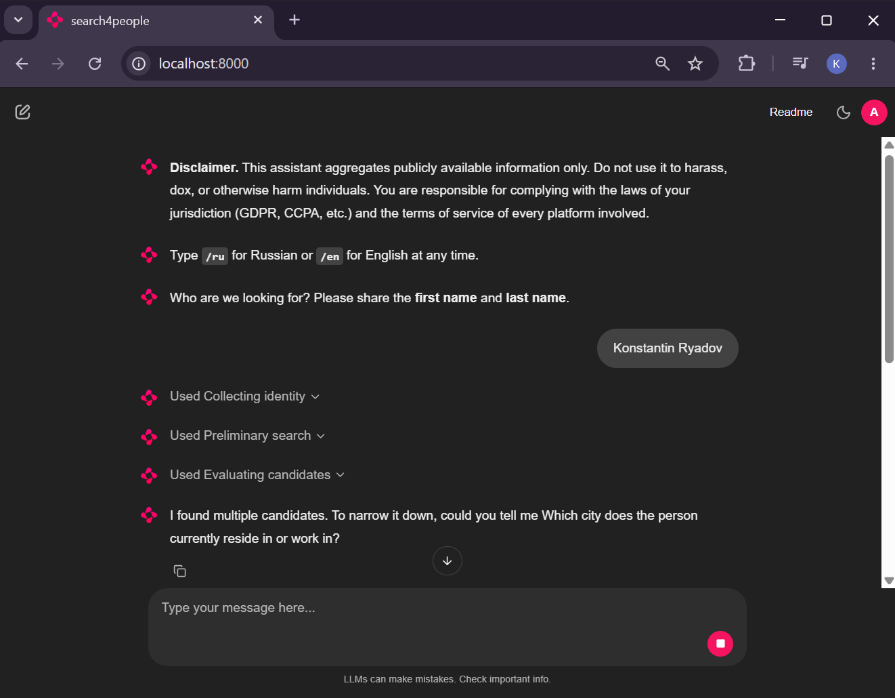
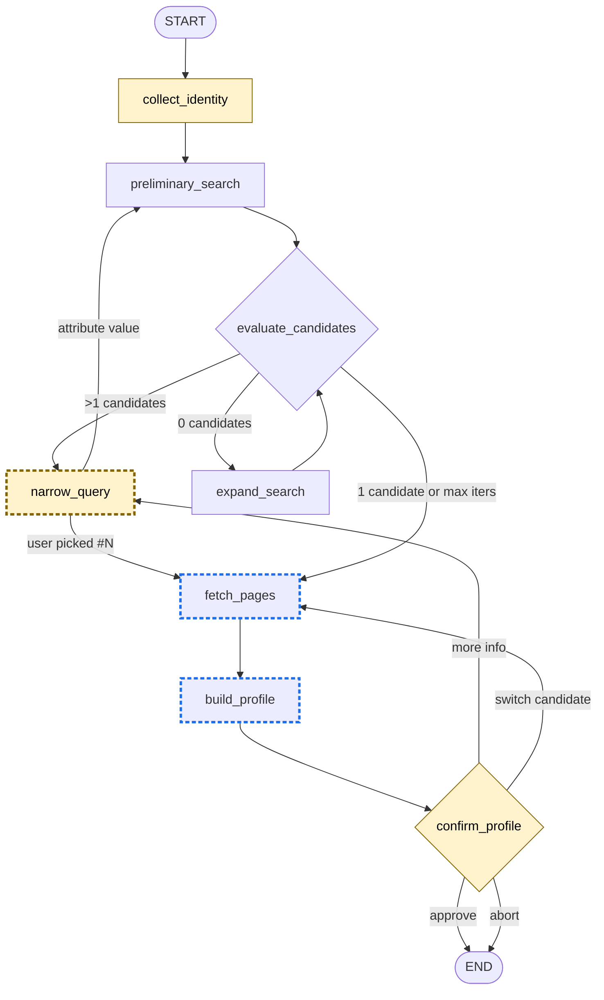
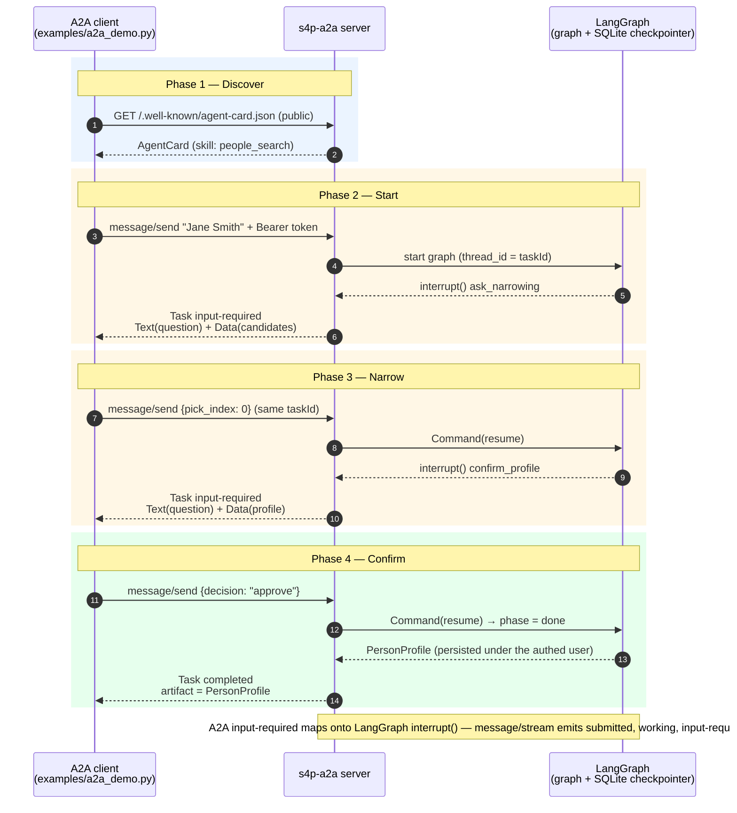

# search4people_v2

Conversational OSINT-style people search powered by **LangGraph 1.x** and **Chainlit 2.x**, running on **Python 3.13** with **uv** as the package manager.


The agent collects a name, runs a preliminary site-restricted search on the top-3 configured platforms (LinkedIn / GitHub / X), narrows the result set through human-in-the-loop clarifying questions when multiple candidates remain, expands to additional platforms when nothing is found, fetches the surviving links, and assembles a structured `PersonProfile` card with cited evidence.

> ⚠️ **Legal & ethics.** This tool aggregates **publicly available** information only. Do not use it to harass, dox, stalk, or otherwise harm individuals. You are responsible for complying with the laws of your jurisdiction (GDPR, CCPA, etc.) and the terms of service of every platform the search visits. Some platforms (LinkedIn, Instagram, Facebook) actively block automated access; expect partial coverage on those.

---

## Features

- LangGraph state machine with a single LLM-controlled `narrow_query` loop and a deterministic routing layer (`evaluate_candidates`).
- Human-in-the-loop via LangGraph `interrupt()`: the chat pauses, the user answers, the graph resumes — all checkpointed in the same SQLite file. When narrowing, the user sees the candidate list with snippet-derived value options and can either pick a candidate by `#N` (skipping straight to fetch) or supply an attribute value.
- Multi-LLM via `init_chat_model` — switch between **Anthropic Claude**, **OpenAI**, and **Ollama** by editing `.env`.
- Two-tier web search: **Tavily** (primary) with **DuckDuckGo** as a free fallback.
- Two-tier page fetcher: `httpx + selectolax` by default, **Playwright** (headless Chromium) as a fallback for JS-heavy or blocked sites.
- Polite scraping: per-host token-bucket rate limit + cached `robots.txt` checker.
- Streaming UI: each graph node surfaces as a `cl.Step` so the user sees what the agent is doing in real time.
- Bilingual (English / Russian) chat UI with a `/ru` `/en` runtime toggle persisted to the user record.
- Local username/password auth with bcrypt-hashed credentials.
- SQLite for users, profiles, source evidence, and LangGraph checkpoints in a single `data/app.db`.
- `Dockerfile` + `docker-compose.yml` for a one-command deployment.
- **A2A (Agent-to-Agent) server** (`uv run s4p-a2a`): exposes people-search as a remote A2A skill. Clarifying questions surface through the A2A `input-required` task state; the final profile is returned as a task artifact. Per-user Bearer-token auth.
- Test suite with `pytest`, lint with `ruff`, type-check with `mypy`.

---

## Architecture

```
Chainlit UI ─► LangGraph StateGraph (AsyncSqliteSaver) ─► Tools (search, fetch, extract)
                                                          │
                                                          └► LLM (Anthropic / OpenAI / Ollama)
                                                          
                                                          SQLite (users + profiles + checkpoints)
```

Graph flow (see `app/graph/build.py`):



- **Yellow fill** — nodes that pause via LangGraph `interrupt()` and resume on the next user message.
- **Blue dashed border** — nodes that invoke the LLM: `narrow_query` (picks the next attribute + value options), `fetch_pages` (per-page structured extraction via `extract_profile_from_page`), `build_profile` (merges per-page partials into one `PersonProfile`).

---

## Prerequisites

- **Python 3.13** (matches `pyproject.toml`'s `requires-python = ">=3.13,<3.14"`)
- **uv ≥ 0.9** (https://docs.astral.sh/uv/)
- API keys for at least one LLM provider (Anthropic, OpenAI, or a running Ollama instance)
- Optional but recommended: a Tavily API key for the primary search provider

---

## Quick start (local)

```bash
# 1. Install deps
uv sync

# 2. Install the Chromium binary for the Playwright fallback
uv run playwright install chromium

# 3. Configure environment
cp .env.example .env
# Edit .env: set LLM_PROVIDER, the matching API key, and TAVILY_API_KEY if you have one.
# Generate a Chainlit auth secret with: openssl rand -hex 32

# 4. Create a local user
uv run s4p-create-user admin <password>

# 5. Run the app
uv run chainlit run app/main.py --port 8000
```

Open <http://localhost:8000>, log in, and start a new chat.

Tips:
- Switch language at any time with `/en` or `/ru`.
- When the agent finds several candidates it prints a numbered list together with
  attribute-value options pulled from the snippets. Reply with `#N` to lock onto
  a specific candidate (skips further narrowing and jumps to fetch), paste one
  of the suggested values, or type any other distinguishing detail.
- Answer `yes` (or `да`) at the confirmation step to save the profile to SQLite.

---

## Quick start (Docker)

```bash
cp .env.example .env  # fill in keys
docker compose up --build
```

The container persists state in the host's `./data` directory.

---

## A2A server (Agent-to-Agent)

search4people can run as an [A2A](https://a2a-protocol.org) server so other agents
can invoke people-search as a remote skill. It reuses the same graph and database
as the Chainlit app and runs as a separate process.

```bash
# 1. Create a user and mint an API token (shown once — save it).
uv run s4p-create-user demo <password>
uv run s4p-create-token demo --label my-agent

# 2. Run the A2A server (defaults to 0.0.0.0:8001).
uv run s4p-a2a
```

- **Agent Card:** `GET http://localhost:8001/.well-known/agent-card.json` (public).
- **Auth:** every JSON-RPC call needs `Authorization: Bearer <token>`. The token maps to
  a user; built profiles are persisted under that user.
- **One skill:** `people_search`. Send a name via `message/send`; if the query is
  ambiguous the task pauses in `input-required` with candidate data, and the final
  `PersonProfile` arrives as a completed-task artifact.

### Demo

With the server running and a token exported, run the end-to-end demo:

```bash
export A2A_DEMO_TOKEN=<token from s4p-create-token>
uv run python examples/a2a_demo.py
```

It fetches the Agent Card, sends a name, answers the `input-required` narrowing and
confirmation prompts, and prints the resulting profile artifact — mirroring how the
LangGraph `interrupt()` pauses map onto A2A `input-required`.

The end-to-end check walks four phases (this is exactly what `examples/a2a_demo.py` does):



---

## Configuration reference (`.env`)

| Variable | Purpose | Default |
|---|---|---|
| `LLM_PROVIDER` | `anthropic` / `openai` / `ollama` | `anthropic` |
| `LLM_MODEL` | Model name passed to `init_chat_model` | `claude-sonnet-4-6` |
| `ANTHROPIC_API_KEY` / `OPENAI_API_KEY` | Provider credentials | — |
| `OLLAMA_BASE_URL` | Ollama endpoint | `http://localhost:11434` |
| `SEARCH_PROVIDERS` | Comma-separated, priority order | `tavily,ddg` |
| `TAVILY_API_KEY` | Required if `tavily` is in the list | — |
| `PLATFORMS_PRIMARY` | Top-3 platforms used in `preliminary_search` | `linkedin,github,twitter` |
| `PLATFORMS_SECONDARY` | Used in `expand_search` | `facebook,instagram,vk` |
| `MAX_ITERATIONS` | Hard ceiling on narrow/expand loops | `7` |
| `PER_HOST_RPS` | Per-host request rate for the fetcher | `1.0` |
| `USER_AGENT` | UA string for HTTP + robots checks | `search4people/0.1 …` |
| `JS_HEAVY_DOMAINS` | Hosts that always go through Playwright | `linkedin.com,instagram.com,facebook.com` |
| `DB_PATH` | SQLite file path | `data/app.db` |
| `CHAINLIT_AUTH_SECRET` | Required by Chainlit for password auth | — |
| `LANGSMITH_TRACING` | Toggle LangSmith spans | `false` |
| `LANGSMITH_API_KEY` / `LANGSMITH_PROJECT` | LangSmith creds | — |
| `A2A_HOST` | Bind host for the A2A server | `0.0.0.0` |
| `A2A_PORT` | Bind port for the A2A server | `8001` |
| `A2A_PUBLIC_URL` | Base URL advertised in the Agent Card | host:port |

---

## Project layout

```
app/
├── main.py              # Chainlit entrypoint + interrupt handling
├── config.py            # pydantic-settings
├── llm.py               # init_chat_model factory
├── i18n.py              # EN/RU translation table
├── auth.py              # @cl.password_auth_callback
├── db/                  # schema + aiosqlite accessors
├── models/              # PersonProfile + graph state
├── a2a/                 # A2A server: executor, agent card, auth, task store
├── graph/               # LangGraph build + nodes + prompts + bridge (headless interrupt/resume)
├── tools/               # search / fetch / extract / robots / rate_limiter
├── ui/                  # profile card + cl.Step helpers
└── scripts/create_user.py  # `uv run s4p-create-user`
tests/                   # pytest suite (tools mocked via respx, graph with a stubbed LLM)
data/                    # runtime SQLite lives here (git-ignored)
```

---

## Development

```bash
uv run ruff check . && uv run ruff format --check .
uv run mypy app
uv run pytest -q
```

The test suite stubs the network and the LLM, so it runs offline without API keys.

---

## Extending

- **Add a platform.** Add an entry to `PLATFORM_SITES` in `app/tools/search.py`, then put its name in `PLATFORMS_PRIMARY` or `PLATFORMS_SECONDARY`.
- **Swap LLM provider.** Edit `LLM_PROVIDER` + `LLM_MODEL` in `.env`. The `init_chat_model` factory does the rest.
- **Add a new node.** Implement it in `app/graph/nodes.py`, register it in `app/graph/build.py`, and (optionally) wire a `cl.Step` label in `app/ui/steps.py`.
- **Call the agent over A2A.** Run `uv run s4p-a2a`, mint a token with `s4p-create-token`, and point any A2A client at the Agent Card. The interrupt↔`input-required` mapping lives in `app/graph/bridge.py`.

---

## License

MIT.
