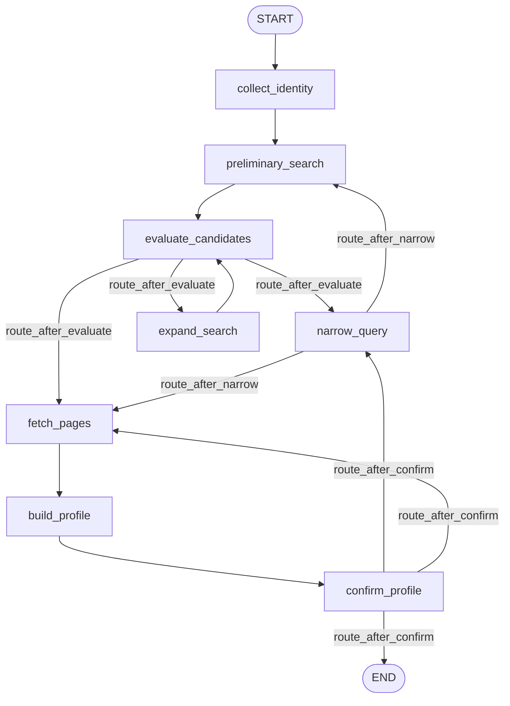

# DeepEval-оценки + DEV.md — Implementation Plan

> **For agentic workers:** REQUIRED SUB-SKILL: Use superpowers:subagent-driven-development (recommended) or superpowers:executing-plans to implement this plan task-by-task. Steps use checkbox (`- [ ]`) syntax for tracking.

**Goal:** Добавить opt-in DeepEval-тесты, оценивающие качество LLM-узлов графа, и написать `DEV.md` с разделами про запуск оценок и изменение графа.

**Architecture:** DeepEval-тесты живут в `tests/evals/`, помечены маркером `eval` и по умолчанию исключены из быстрого прогона (`addopts = -m "not eval"`). Судьёй (LLM-as-judge) выступает обёртка `LangChainJudge` над `app/llm.py`, поэтому по умолчанию оценки идут локально через Ollama+`gpt-oss` без ключей. Реальные LLM-узлы прогоняются на фиксированных голден-данных в `tests/evals/data/`; отдельный живой e2e-smoke помечен дополнительно маркером `live`.

**Tech Stack:** Python 3.13, pytest + pytest-asyncio, deepeval 4.0.5, LangGraph, LangChain, uv.

---

## Замечание о состоянии репозитория

`deepeval` уже добавлен в dev-группу (`uv add --group dev deepeval` выполнен; `pyproject.toml` и `uv.lock` изменены, пакет 4.0.5 установлен в `.venv`). Task 1 фиксирует это изменение коммитом и добавляет регистрацию маркеров + `addopts`. Если зависимость по какой-то причине отсутствует — выполнить `uv add --group dev deepeval` повторно.

---

## Структура файлов

- Modify: `pyproject.toml` — dev-зависимость `deepeval`, маркеры `eval`/`live`, `addopts`.
- Modify: `tests/conftest.py` — не подменять env фейковым anthropic-ключом для eval-тестов.
- Modify: `app/graph/nodes.py` — выделить `plan_narrowing`, переключить `narrow_query` на него.
- Create: `tests/test_narrow_planning.py` — детерминированный unit-тест `plan_narrowing` (быстрый, не eval).
- Create: `tests/evals/__init__.py` — пустой пакетный маркер.
- Create: `tests/evals/judge.py` — `LangChainJudge(DeepEvalBaseLLM)`.
- Create: `tests/evals/conftest.py` — telemetry opt-out + автоскип при недоступном судье.
- Create: `tests/evals/data/pages/jane_doe_github.md` — голден-страница (positive).
- Create: `tests/evals/data/pages/not_jane_doe.md` — голден-страница (negative).
- Create: `tests/evals/data/candidates/jane_doe.json` — фикс. список кандидатов.
- Create: `tests/evals/data/goldens.json` — ожидаемые/запрещённые факты.
- Create: `tests/evals/test_extract_faithfulness.py` — faithfulness/hallucination.
- Create: `tests/evals/test_build_profile_quality.py` — корректность structured output.
- Create: `tests/evals/test_narrow_query_quality.py` — качество уточняющего вопроса.
- Create: `tests/evals/test_e2e_relevance.py` — живой e2e-smoke (`eval`+`live`).
- Create: `DEV.md` — документация.

---

## Task 1: Зависимость, маркеры, дефолтное исключение eval

**Files:**
- Modify: `pyproject.toml`

- [ ] **Step 1: Зарегистрировать маркеры и исключить eval по умолчанию**

В `pyproject.toml` найти блок:

```toml
[tool.pytest.ini_options]
asyncio_mode = "auto"
testpaths = ["tests"]
addopts = "-ra --strict-markers"
filterwarnings = [
    "ignore::DeprecationWarning",
]
```

Заменить на:

```toml
[tool.pytest.ini_options]
asyncio_mode = "auto"
testpaths = ["tests"]
addopts = "-ra --strict-markers -m \"not eval\""
markers = [
    "eval: LLM-quality evals via DeepEval (opt-in; run with `pytest -m eval`)",
    "live: hits the live web/search stack (opt-in; run with `pytest -m \"eval and live\"`)",
]
filterwarnings = [
    "ignore::DeprecationWarning",
]
```

- [ ] **Step 2: Убедиться, что `deepeval` присутствует в dev-группе**

Проверить, что в `pyproject.toml` в `[dependency-groups].dev` есть строка `"deepeval>=4.0,<5.0"` (или эквивалент, добавленный `uv add`). Если её нет — выполнить:

Run: `uv add --group dev deepeval`

- [ ] **Step 3: Проверить, что быстрый прогон по-прежнему зелёный и не трогает eval**

Run: `uv run pytest -q`
Expected: PASS — все существующие тесты проходят, eval-тесты (которых пока нет) не собираются; в summary нет ошибок маркеров (`--strict-markers` доволен).

- [ ] **Step 4: Commit**

```bash
git add pyproject.toml uv.lock
git commit -m "build: add deepeval dev dep, register eval/live markers, exclude evals by default"
```

---

## Task 2: Не подменять окружение для eval-тестов

Глобальная autouse-фикстура `_isolate_env` в `tests/conftest.py` принудительно ставит `LLM_PROVIDER=anthropic` и фейковый `ANTHROPIC_API_KEY=test-key`. Для eval-тестов это сломало бы судью (он попытался бы ходить в Anthropic с мусорным ключом). Нужно для eval-помеченных тестов оставить реальное окружение (`.env` → Ollama), но всё равно сбрасывать кэш настроек.

**Files:**
- Modify: `tests/conftest.py`

- [ ] **Step 1: Прочитать текущую фикстуру**

Run: `cat tests/conftest.py`
Expected: видим autouse-фикстуру `_isolate_env(monkeypatch, tmp_path)`.

- [ ] **Step 2: Заменить фикстуру на вариант, пропускающий подмену для eval**

Заменить функцию `_isolate_env` на:

```python
@pytest.fixture(autouse=True)
def _isolate_env(
    request: pytest.FixtureRequest, monkeypatch: pytest.MonkeyPatch, tmp_path: Path
) -> None:
    from app.config import get_settings

    # Eval tests must use the real environment (.env → local Ollama judge),
    # not the fake Anthropic key below. We still reset the settings cache.
    if request.node.get_closest_marker("eval") is not None:
        get_settings.cache_clear()
        yield
        get_settings.cache_clear()
        return

    monkeypatch.setenv("DB_PATH", str(tmp_path / "test.db"))
    monkeypatch.setenv("CHAINLIT_AUTH_SECRET", "test-secret-must-be-long-enough")
    monkeypatch.setenv("LLM_PROVIDER", "anthropic")
    monkeypatch.setenv("ANTHROPIC_API_KEY", "test-key")
    monkeypatch.setenv("TAVILY_API_KEY", "")  # force DDG-only path in tests
    monkeypatch.setenv("SEARCH_PROVIDERS", "ddg")
    monkeypatch.setenv("LANGSMITH_TRACING", "false")
    # Drop the lru_cached settings singleton between tests.
    get_settings.cache_clear()
    yield
    get_settings.cache_clear()
```

(Импорт `Path` уже присутствует в файле; `pytest` уже импортирован.)

- [ ] **Step 3: Проверить, что быстрый прогон не сломался**

Run: `uv run pytest -q`
Expected: PASS — поведение не-eval тестов не изменилось.

- [ ] **Step 4: Commit**

```bash
git add tests/conftest.py
git commit -m "test: keep real env (Ollama judge) for eval-marked tests"
```

---

## Task 3: Рефакторинг — выделить `plan_narrowing` (TDD)

Делаем LLM-планирование уточнения тестируемым в изоляции, не меняя поведения графа.

**Files:**
- Modify: `app/graph/nodes.py`
- Test: `tests/test_narrow_planning.py`

- [ ] **Step 1: Написать падающий тест**

Создать `tests/test_narrow_planning.py`:

```python
"""Deterministic unit test for the narrowing planner (no real LLM)."""

from __future__ import annotations

from unittest.mock import AsyncMock, MagicMock

import pytest

from app.graph import nodes


@pytest.mark.asyncio
async def test_plan_narrowing_parses_llm_json(monkeypatch):
    fake_model = MagicMock()
    fake_model.ainvoke = AsyncMock(
        return_value=MagicMock(
            content=(
                '{"attribute": "employer", '
                '"question_en": "Where do they work?", '
                '"question_ru": "Где они работают?", '
                '"options": ["Acme", "Acme", "Globex", "  "]}'
            )
        )
    )
    monkeypatch.setattr(nodes, "build_chat_model", lambda **kw: fake_model)

    plan = await nodes.plan_narrowing(
        candidates=[{"url": "https://x/1", "title": "t", "snippet": "s", "platform": "web"}],
        query={"first_name": "John", "last_name": "Doe"},
        locale="en",
    )

    assert plan["attribute"] == "employer"
    assert plan["question"] == "Where do they work?"
    # Deduped, stripped, empty dropped:
    assert plan["options"] == ["Acme", "Globex"]


@pytest.mark.asyncio
async def test_plan_narrowing_falls_back_on_bad_json(monkeypatch):
    fake_model = MagicMock()
    fake_model.ainvoke = AsyncMock(return_value=MagicMock(content="not json at all"))
    monkeypatch.setattr(nodes, "build_chat_model", lambda **kw: fake_model)

    plan = await nodes.plan_narrowing(
        candidates=[],
        query={"first_name": "John", "last_name": "Doe"},
        locale="ru",
    )

    assert plan["attribute"] is None
    assert isinstance(plan["question"], str) and plan["question"]
    assert plan["options"] == []
```

- [ ] **Step 2: Запустить тест — убедиться, что падает**

Run: `uv run pytest tests/test_narrow_planning.py -v`
Expected: FAIL — `AttributeError: module 'app.graph.nodes' has no attribute 'plan_narrowing'`.

- [ ] **Step 3: Реализовать `plan_narrowing` и переключить `narrow_query`**

В `app/graph/nodes.py` добавить новую функцию непосредственно перед `async def narrow_query`:

```python
async def plan_narrowing(
    candidates: list[dict[str, Any]], query: IdentityQuery, locale: str
) -> dict[str, Any]:
    """Ask the LLM which distinguishing attribute to request next.

    Pure (no `interrupt`) so it can be evaluated in isolation. Returns a dict
    with keys: `attribute` (str | None), `question` (str), `options` (list[str]).
    """
    prompt = NARROW_QUERY_PROMPT.format(
        candidates=_short_candidate_list(candidates),
        known_attributes=_distinguishers(query) or "(none yet)",
    )
    model = build_chat_model(temperature=0.0)
    response = await model.ainvoke(
        [SystemMessage(content=SYSTEM_RESEARCHER), HumanMessage(content=prompt)]
    )
    plan = _safe_json(response.content) or {}
    attribute = plan.get("attribute")
    question = (
        plan.get(f"question_{locale}")
        or "Could you share any additional distinguishing details?"
    )
    raw_options = plan.get("options") or []
    options: list[str] = []
    if isinstance(raw_options, list):
        seen: set[str] = set()
        for o in raw_options:
            if isinstance(o, str):
                stripped = o.strip()
                if stripped and stripped.lower() not in seen:
                    options.append(stripped)
                    seen.add(stripped.lower())
    return {"attribute": attribute, "question": question, "options": options}
```

Затем заменить в `narrow_query` блок от `prompt = NARROW_QUERY_PROMPT.format(` до конца построения `options` (строки, формирующие `attribute`, `question`, `options`) на:

```python
    plan = await plan_narrowing(candidates, query, locale)
    attribute = plan["attribute"]
    question = plan["question"]
    options = plan["options"]
```

Конкретно — внутри `narrow_query` удалить этот фрагмент:

```python
    prompt = NARROW_QUERY_PROMPT.format(
        candidates=_short_candidate_list(candidates),
        known_attributes=_distinguishers(query) or "(none yet)",
    )
    model = build_chat_model(temperature=0.0)
    response = await model.ainvoke(
        [SystemMessage(content=SYSTEM_RESEARCHER), HumanMessage(content=prompt)]
    )
    plan = _safe_json(response.content) or {}
    attribute = plan.get("attribute")
    question = (
        plan.get(f"question_{locale}") or "Could you share any additional distinguishing details?"
    )
    raw_options = plan.get("options") or []
    options: list[str] = []
    if isinstance(raw_options, list):
        seen: set[str] = set()
        for o in raw_options:
            if isinstance(o, str):
                stripped = o.strip()
                if stripped and stripped.lower() not in seen:
                    options.append(stripped)
                    seen.add(stripped.lower())
```

и поставить на его место четыре строки `plan = await plan_narrowing(...)` выше. Остальное тело `narrow_query` (вызов `interrupt(...)` и обработка ответа) не трогаем.

- [ ] **Step 4: Запустить тест — убедиться, что проходит**

Run: `uv run pytest tests/test_narrow_planning.py -v`
Expected: PASS — оба теста зелёные.

- [ ] **Step 5: Прогнать весь быстрый набор (регрессия графа)**

Run: `uv run pytest -q`
Expected: PASS — включая `tests/test_graph_flow.py` (поведение графа не изменилось).

- [ ] **Step 6: Commit**

```bash
git add app/graph/nodes.py tests/test_narrow_planning.py
git commit -m "refactor: extract pure plan_narrowing helper from narrow_query"
```

---

## Task 4: Судья DeepEval + eval-conftest

**Files:**
- Create: `tests/evals/__init__.py`
- Create: `tests/evals/judge.py`
- Create: `tests/evals/conftest.py`

- [ ] **Step 1: Создать пакет**

Создать пустой файл `tests/evals/__init__.py` (без содержимого).

- [ ] **Step 2: Реализовать судью**

Создать `tests/evals/judge.py`:

```python
"""DeepEval judge that reuses the application's configured chat model.

Routing the LLM-as-judge through `app.llm.build_chat_model` means evals use the
same provider/model as the app — by default local Ollama + gpt-oss, no API key.
"""

from __future__ import annotations

from typing import Any

from deepeval.models.base_model import DeepEvalBaseLLM
from pydantic import BaseModel

from app.config import get_settings
from app.llm import build_chat_model


class LangChainJudge(DeepEvalBaseLLM):
    """Adapter exposing the app's chat model through DeepEval's LLM interface."""

    def __init__(self, temperature: float = 0.0) -> None:
        self._temperature = temperature
        self._model: Any = None

    def load_model(self) -> Any:
        if self._model is None:
            self._model = build_chat_model(temperature=self._temperature)
        return self._model

    def get_model_name(self) -> str:
        return f"app-llm:{get_settings().llm_model}"

    def generate(self, prompt: str, schema: type[BaseModel] | None = None, **kwargs: Any) -> Any:
        model = self.load_model()
        if schema is not None:
            return model.with_structured_output(schema).invoke(prompt)
        result = model.invoke(prompt)
        return getattr(result, "content", str(result))

    async def a_generate(
        self, prompt: str, schema: type[BaseModel] | None = None, **kwargs: Any
    ) -> Any:
        model = self.load_model()
        if schema is not None:
            return await model.with_structured_output(schema).ainvoke(prompt)
        result = await model.ainvoke(prompt)
        return getattr(result, "content", str(result))
```

- [ ] **Step 3: Реализовать eval-conftest (telemetry opt-out + автоскип)**

Создать `tests/evals/conftest.py`:

```python
"""Fixtures for DeepEval evals.

- Opt out of DeepEval network telemetry.
- Skip cleanly when the judge LLM is unavailable (cloud provider without a key,
  or local Ollama not reachable) instead of failing.
"""

from __future__ import annotations

import os

import pytest


def _judge_unavailable_reason() -> str | None:
    """Return a human reason if the judge can't run, else None."""
    from app.config import get_settings

    settings = get_settings()
    provider = settings.llm_provider
    if provider == "anthropic" and not settings.anthropic_api_key:
        return "ANTHROPIC_API_KEY is not set"
    if provider == "openai" and not settings.openai_api_key:
        return "OPENAI_API_KEY is not set"
    if provider == "ollama":
        import httpx

        try:
            httpx.get(settings.ollama_base_url, timeout=2.0)
        except Exception:  # noqa: BLE001 — any connection failure means skip
            return f"Ollama not reachable at {settings.ollama_base_url}"
    return None


@pytest.fixture(scope="session", autouse=True)
def _deepeval_telemetry_off() -> None:
    os.environ.setdefault("DEEPEVAL_TELEMETRY_OPT_OUT", "1")
    os.environ.setdefault("ERROR_REPORTING", "0")
    yield


@pytest.fixture(autouse=True)
def _require_judge() -> None:
    reason = _judge_unavailable_reason()
    if reason:
        pytest.skip(f"DeepEval judge unavailable: {reason}")
```

- [ ] **Step 4: Smoke-проверка импортов и скипа**

Run: `uv run pytest tests/evals -m eval -q`
Expected: либо PASS/собрано 0 (тестов ещё нет) без ошибок импорта; команда не падает. (Файлов тестов пока нет — допустим «no tests ran».)

- [ ] **Step 5: Commit**

```bash
git add tests/evals/__init__.py tests/evals/judge.py tests/evals/conftest.py
git commit -m "test(evals): add LangChainJudge and eval conftest (telemetry off, skip-if-unavailable)"
```

---

## Task 5: Голден-данные

**Files:**
- Create: `tests/evals/data/pages/jane_doe_github.md`
- Create: `tests/evals/data/pages/not_jane_doe.md`
- Create: `tests/evals/data/candidates/jane_doe.json`
- Create: `tests/evals/data/goldens.json`

- [ ] **Step 1: Positive-страница**

Создать `tests/evals/data/pages/jane_doe_github.md`:

```markdown
# Jane Doe

**jane-doe** · she/her · San Francisco, California

Senior Software Engineer at Globex Corporation. Previously at Acme Inc.
Studied Computer Science at Stanford University (2012–2016).

## Bio
Jane Doe builds distributed systems in Rust and Go. Maintainer of the
open-source `fastqueue` library. Conference speaker — gave a talk on
async runtimes at RustConf 2023.

## Links
- Twitter: @jane_doe_dev
- Website: https://janedoe.dev

## Pinned repositories
- fastqueue — a fast async queue (Rust)
- go-utils — assorted Go helpers
```

- [ ] **Step 2: Negative-страница (не про целевого человека)**

Создать `tests/evals/data/pages/not_jane_doe.md`:

```markdown
# John Smith — Plumbing Services

John Smith has been a licensed plumber in Manchester since 1998.
We offer boiler repair, bathroom installation, and emergency callouts.

Contact: 0161-555-0100. No relation to any software engineer.
```

- [ ] **Step 3: Фиксированный список кандидатов**

Создать `tests/evals/data/candidates/jane_doe.json`:

```json
[
  {
    "url": "https://github.com/jane-doe",
    "title": "Jane Doe (jane-doe) · GitHub",
    "snippet": "Senior Software Engineer at Globex Corporation. Rust and Go.",
    "platform": "github",
    "confidence": 0.6
  },
  {
    "url": "https://www.linkedin.com/in/jane-doe-acme",
    "title": "Jane Doe — Software Engineer — Acme Inc | LinkedIn",
    "snippet": "Software Engineer at Acme Inc, San Francisco Bay Area.",
    "platform": "linkedin",
    "confidence": 0.5
  },
  {
    "url": "https://twitter.com/jane_doe_dev",
    "title": "Jane Doe (@jane_doe_dev) / Twitter",
    "snippet": "Distributed systems. Maintainer of fastqueue. Stanford CS.",
    "platform": "twitter",
    "confidence": 0.5
  }
]
```

- [ ] **Step 4: Ожидаемые/запрещённые факты**

Создать `tests/evals/data/goldens.json`:

```json
{
  "jane_doe_github": {
    "full_name": "Jane Doe",
    "url": "https://github.com/jane-doe",
    "expected_facts": [
      "Globex Corporation",
      "Stanford University",
      "San Francisco"
    ],
    "forbidden_facts": [
      "any employer other than Globex or Acme",
      "any university other than Stanford",
      "a specific date of birth",
      "a home street address or phone number"
    ]
  },
  "not_jane_doe": {
    "full_name": "Jane Doe",
    "url": "https://example.com/john-smith-plumbing"
  }
}
```

- [ ] **Step 5: Commit**

```bash
git add tests/evals/data
git commit -m "test(evals): add golden pages, candidates and expectations"
```

---

## Task 6: Тест faithfulness/hallucination для `extract_profile_from_page`

**Files:**
- Create: `tests/evals/test_extract_faithfulness.py`

- [ ] **Step 1: Написать тест**

Создать `tests/evals/test_extract_faithfulness.py`:

```python
"""Eval: extraction must stay faithful to the source page and not fabricate."""

from __future__ import annotations

import json
import pathlib

import pytest
from deepeval import assert_test
from deepeval.metrics import FaithfulnessMetric, GEval, HallucinationMetric
from deepeval.test_case import LLMTestCase, LLMTestCaseParams

from app.tools.extract import extract_profile_from_page
from tests.evals.judge import LangChainJudge

DATA = pathlib.Path(__file__).parent / "data"


def _goldens() -> dict:
    return json.loads((DATA / "goldens.json").read_text(encoding="utf-8"))


@pytest.mark.eval
@pytest.mark.asyncio
async def test_extract_is_faithful_to_page():
    page = (DATA / "pages" / "jane_doe_github.md").read_text(encoding="utf-8")
    golden = _goldens()["jane_doe_github"]

    profile = await extract_profile_from_page(
        full_name=golden["full_name"],
        distinguishers="",
        url=golden["url"],
        markdown=page,
        platform="github",
    )

    test_case = LLMTestCase(
        input=f"Extract a factual profile for {golden['full_name']} from the page.",
        actual_output=profile.as_markdown(),
        retrieval_context=[page],
        context=[page],
    )

    judge = LangChainJudge()
    no_fabrication = GEval(
        name="NoFabrication",
        criteria=(
            "Determine whether every concrete claim in the actual output "
            "(employers, schools, locations, links, dates) is directly supported "
            "by the page in retrieval context. Penalize any invented fact."
        ),
        evaluation_params=[
            LLMTestCaseParams.ACTUAL_OUTPUT,
            LLMTestCaseParams.RETRIEVAL_CONTEXT,
        ],
        model=judge,
        threshold=0.6,
    )

    assert_test(
        test_case,
        [
            FaithfulnessMetric(threshold=0.6, model=judge),
            HallucinationMetric(threshold=0.4, model=judge),
            no_fabrication,
        ],
    )


@pytest.mark.eval
@pytest.mark.asyncio
async def test_extract_rejects_unrelated_page():
    """A page that is not about the target → empty profile, low confidence."""
    page = (DATA / "pages" / "not_jane_doe.md").read_text(encoding="utf-8")
    golden = _goldens()["not_jane_doe"]

    profile = await extract_profile_from_page(
        full_name=golden["full_name"],
        distinguishers="",
        url=golden["url"],
        markdown=page,
        platform="web",
    )

    # Deterministic structural assertions (no judge needed):
    assert profile.full_name  # name echoed back
    assert profile.confidence == "low"
    assert profile.education == []
    assert profile.work == []
```

- [ ] **Step 2: Запустить (нужен локальный Ollama с gpt-oss)**

Run: `uv run pytest tests/evals/test_extract_faithfulness.py -m eval -v`
Expected: PASS, либо SKIP с причиной «Ollama not reachable» если сервер не запущен. Если PASS — обе проверки зелёные.

- [ ] **Step 3: Commit**

```bash
git add tests/evals/test_extract_faithfulness.py
git commit -m "test(evals): faithfulness + no-fabrication for page extraction"
```

---

## Task 7: Тест корректности `build_profile`

`build_profile` — узел графа; вызываем его напрямую, подсунув `fetched_pages` с фикс. partials, и стабаем `build_chat_model`? Нет — это eval, нам нужен НАСТОЯЩИЙ LLM-мёрдж. Поэтому формируем state с реальными partials (полученными прогоном extract на голден-странице) и вызываем `build_profile` без стабов.

**Files:**
- Create: `tests/evals/test_build_profile_quality.py`

- [ ] **Step 1: Написать тест**

Создать `tests/evals/test_build_profile_quality.py`:

```python
"""Eval: build_profile must merge partials into a supported, well-formed profile."""

from __future__ import annotations

import json
import pathlib

import pytest
from deepeval import assert_test
from deepeval.metrics import GEval
from deepeval.test_case import LLMTestCase, LLMTestCaseParams

from app.graph.nodes import build_profile
from app.models.profile import PersonProfile
from app.tools.extract import extract_profile_from_page
from tests.evals.judge import LangChainJudge

DATA = pathlib.Path(__file__).parent / "data"


@pytest.mark.eval
@pytest.mark.asyncio
async def test_build_profile_is_well_formed_and_supported():
    page = (DATA / "pages" / "jane_doe_github.md").read_text(encoding="utf-8")
    golden = json.loads((DATA / "goldens.json").read_text(encoding="utf-8"))["jane_doe_github"]

    partial = await extract_profile_from_page(
        full_name=golden["full_name"],
        distinguishers="",
        url=golden["url"],
        markdown=page,
        platform="github",
    )

    state = {
        "query": {"first_name": "Jane", "last_name": "Doe"},
        "fetched_pages": [
            {
                "url": golden["url"],
                "platform": "github",
                "snippet": "",
                "markdown_len": len(page),
                "partial": partial.model_dump(mode="json"),
            }
        ],
    }

    patch = await build_profile(state)

    # Deterministic: result validates as a PersonProfile and carries evidence.
    profile = PersonProfile.model_validate(patch["profile"])
    assert profile.full_name
    assert profile.evidence, "merged profile must cite at least one source"

    # Judge: every field is supported by the source page.
    test_case = LLMTestCase(
        input="Merge the extracted partial(s) into one coherent profile.",
        actual_output=profile.as_markdown(),
        retrieval_context=[page],
    )
    supported = GEval(
        name="EvidenceSupported",
        criteria=(
            "Check that each fact in the profile is supported by the source page, "
            "that the profile cites sources, and that the stated confidence is "
            "reasonable for the amount of corroborating evidence (a single source "
            "should not yield 'high')."
        ),
        evaluation_params=[
            LLMTestCaseParams.ACTUAL_OUTPUT,
            LLMTestCaseParams.RETRIEVAL_CONTEXT,
        ],
        model=LangChainJudge(),
        threshold=0.6,
    )
    assert_test(test_case, [supported])
```

- [ ] **Step 2: Запустить**

Run: `uv run pytest tests/evals/test_build_profile_quality.py -m eval -v`
Expected: PASS или SKIP (если Ollama недоступен).

- [ ] **Step 3: Commit**

```bash
git add tests/evals/test_build_profile_quality.py
git commit -m "test(evals): structured-output quality for build_profile"
```

---

## Task 8: Тест качества `plan_narrowing`

**Files:**
- Create: `tests/evals/test_narrow_query_quality.py`

- [ ] **Step 1: Написать тест**

Создать `tests/evals/test_narrow_query_quality.py`:

```python
"""Eval: the narrowing planner asks a clear, discriminating question."""

from __future__ import annotations

import json
import pathlib

import pytest
from deepeval import assert_test
from deepeval.metrics import GEval
from deepeval.test_case import LLMTestCase, LLMTestCaseParams

from app.graph.nodes import plan_narrowing
from tests.evals.judge import LangChainJudge

DATA = pathlib.Path(__file__).parent / "data"

VALID_ATTRIBUTES = {
    "age", "country", "city", "school", "university",
    "employer", "profession", "distinctive_event",
}


@pytest.mark.eval
@pytest.mark.asyncio
async def test_narrowing_question_is_discriminating_en():
    candidates = json.loads(
        (DATA / "candidates" / "jane_doe.json").read_text(encoding="utf-8")
    )
    query = {"first_name": "Jane", "last_name": "Doe"}

    plan = await plan_narrowing(candidates, query, locale="en")

    # Deterministic structural checks:
    assert plan["attribute"] in VALID_ATTRIBUTES
    assert plan["question"].strip()

    test_case = LLMTestCase(
        input=(
            "Given several candidates named Jane Doe (GitHub/Globex, "
            "LinkedIn/Acme, Twitter), the assistant must ask ONE question to "
            "tell them apart."
        ),
        actual_output=f"attribute={plan['attribute']}; question={plan['question']}",
        retrieval_context=[json.dumps(candidates, ensure_ascii=False)],
    )
    quality = GEval(
        name="DiscriminatingQuestion",
        criteria=(
            "The question must be a single, clear, polite question in English "
            "that asks for an attribute genuinely useful to distinguish between "
            "the candidates (e.g. employer or city), not a generic or redundant "
            "one."
        ),
        evaluation_params=[
            LLMTestCaseParams.INPUT,
            LLMTestCaseParams.ACTUAL_OUTPUT,
        ],
        model=LangChainJudge(),
        threshold=0.6,
    )
    assert_test(test_case, [quality])
```

- [ ] **Step 2: Запустить**

Run: `uv run pytest tests/evals/test_narrow_query_quality.py -m eval -v`
Expected: PASS или SKIP.

- [ ] **Step 3: Commit**

```bash
git add tests/evals/test_narrow_query_quality.py
git commit -m "test(evals): discriminating-question quality for plan_narrowing"
```

---

## Task 9: Живой e2e-smoke (релевантность кандидатов)

Гоняет весь граф с реальным веб-поиском и fetch по известной публичной персоне, программно проходя `interrupt`-ы. Помечен `eval`+`live` — двойной opt-in. Best-effort, толерантный порог.

**Files:**
- Create: `tests/evals/test_e2e_relevance.py`

- [ ] **Step 1: Написать тест**

Создать `tests/evals/test_e2e_relevance.py`:

```python
"""Live e2e smoke: the graph should produce a profile about the intended person.

Opt-in: requires `-m "eval and live"`, network access, and a running judge.
Best-effort — tolerant threshold, single case.
"""

from __future__ import annotations

import pytest
from langgraph.checkpoint.memory import InMemorySaver
from langgraph.types import Command

from deepeval import assert_test
from deepeval.metrics import GEval
from deepeval.test_case import LLMTestCase, LLMTestCaseParams

from app.graph.build import build_graph
from app.models.profile import PersonProfile
from tests.evals.judge import LangChainJudge

TARGET = {"first_name": "Guido", "last_name": "van Rossum"}


async def _run_to_completion(graph, config, initial):
    """Drive the graph, auto-approving any interrupt until it ends."""
    result = await graph.ainvoke(initial, config=config)
    # Resume through interrupts (identity already provided → narrow/confirm).
    for _ in range(6):
        snapshot = await graph.aget_state(config)
        if not any(t.interrupts for t in snapshot.tasks):
            break
        # Approve / accept defaults at every pause.
        result = await graph.ainvoke(Command(resume={"decision": "approve"}), config=config)
    return await graph.aget_state(config)


@pytest.mark.eval
@pytest.mark.live
@pytest.mark.asyncio
async def test_e2e_profile_is_about_target_person():
    graph = build_graph().compile(checkpointer=InMemorySaver())
    config = {"configurable": {"thread_id": "e2e-1"}}
    initial = {"query": TARGET, "locale": "en"}

    snapshot = await _run_to_completion(graph, config, initial)
    profile_dict = snapshot.values.get("profile")
    if not profile_dict:
        pytest.skip("graph did not yield a profile (live search returned nothing)")

    profile = PersonProfile.model_validate(profile_dict)
    test_case = LLMTestCase(
        input="Find a public profile for Guido van Rossum, creator of Python.",
        actual_output=profile.as_markdown(),
    )
    on_target = GEval(
        name="AboutTargetPerson",
        criteria=(
            "Judge whether the profile plausibly refers to Guido van Rossum, the "
            "creator of the Python programming language. It need not be complete, "
            "but it must not describe a clearly different person."
        ),
        evaluation_params=[
            LLMTestCaseParams.INPUT,
            LLMTestCaseParams.ACTUAL_OUTPUT,
        ],
        model=LangChainJudge(),
        threshold=0.5,
    )
    assert_test(test_case, [on_target])
```

- [ ] **Step 2: Убедиться, что без `live` тест не собирается**

Run: `uv run pytest tests/evals -m eval -v`
Expected: `test_e2e_*` помечен как deselected (т.к. при `-m eval` выражение `eval` истинно, но мы хотим, чтобы он шёл только с `live`). **Если** он собирается при `-m eval` — это ожидаемо (он `eval`); чтобы исключить из обычного eval-прогона, запускать остальные через `-m "eval and not live"`. Зафиксировать это в DEV.md (Task 10).

- [ ] **Step 3: Запустить живой тест (опционально, нужна сеть + Ollama)**

Run: `uv run pytest tests/evals/test_e2e_relevance.py -m "eval and live" -v`
Expected: PASS или SKIP (сеть/поиск ничего не вернул) — без падения инфраструктуры.

- [ ] **Step 4: Commit**

```bash
git add tests/evals/test_e2e_relevance.py
git commit -m "test(evals): live e2e relevance smoke for the full graph"
```

---

## Task 10: DEV.md

**Files:**
- Create: `DEV.md`

- [ ] **Step 1: Сгенерировать Mermaid-диаграмму текущего графа**

На основе `app/graph/build.py` граф такой (узлы и рёбра):

```
START → collect_identity → preliminary_search → evaluate_candidates
evaluate_candidates ─(route_after_evaluate)→ {narrow_query | expand_search | fetch_pages}
narrow_query ─(route_after_narrow)→ {preliminary_search | fetch_pages}
expand_search → evaluate_candidates
fetch_pages → build_profile → confirm_profile
confirm_profile ─(route_after_confirm)→ {narrow_query | fetch_pages | END}
```

- [ ] **Step 2: Написать DEV.md**

Создать `DEV.md`:

````markdown
# DEV — разработка search4people_v2

Документ для разработчиков: как запускать оценки качества LLM (DeepEval) и как
безопасно менять граф LangGraph.

## Содержание
- [Тесты и оценки](#тесты-и-оценки)
  - [Быстрый набор](#быстрый-набор)
  - [Оценки качества через DeepEval](#оценки-качества-через-deepeval)
- [Как менять граф](#как-менять-граф)

---

## Тесты и оценки

### Быстрый набор

Обычный прогон — детерминированный, без сети и без LLM (всё замокано):

```bash
uv run pytest
```

В `pyproject.toml` стоит `addopts = -ra --strict-markers -m "not eval"`, поэтому
тяжёлые DeepEval-тесты по умолчанию **не запускаются**.

### Оценки качества через DeepEval

DeepEval-тесты оценивают качество выводов LLM-узлов графа с помощью
LLM-as-judge. Это медленнее и недетерминированно, поэтому они opt-in.

**Судья по умолчанию — локальный.** Судья ходит через тот же провайдер, что и
приложение (`app/llm.py` → `Settings`). По умолчанию (`.env.example`) это
**Ollama + `gpt-oss`**, то есть оценки идут локально и бесплатно — API-ключи не
нужны. Требуется лишь запущенный Ollama:

```bash
ollama serve            # если ещё не запущен
ollama pull gpt-oss     # один раз
```

**Запуск оценок (кроме живого e2e):**

```bash
uv run pytest -m "eval and not live"
```

**Запуск конкретной группы:**

```bash
uv run pytest tests/evals/test_extract_faithfulness.py -m eval -v
```

**Живой end-to-end smoke** (ходит в реальный веб-поиск/страницы, флапает):

```bash
uv run pytest -m "eval and live"
```

**Если судья недоступен** (выбран cloud-провайдер без ключа, либо Ollama не
поднят) — eval-тесты **скипаются**, а не падают (см.
`tests/evals/conftest.py`).

**Сменить судью на более сильную модель** (например, для разовой строгой
проверки) — через переменные окружения / `.env`:

```bash
LLM_PROVIDER=anthropic LLM_MODEL=claude-sonnet-4-6 ANTHROPIC_API_KEY=... \
  uv run pytest -m "eval and not live"
```

**Структура `tests/evals/`:**

| Файл | Что проверяет |
|------|---------------|
| `judge.py` | `LangChainJudge` — обёртка `app/llm.py` под интерфейс DeepEval |
| `conftest.py` | отключение телеметрии DeepEval + автоскип при недоступном судье |
| `data/pages/*.md` | сохранённые страницы — входы и `retrieval_context` |
| `data/candidates/*.json` | фиксированные списки кандидатов |
| `data/goldens.json` | ожидаемые и запрещённые факты |
| `test_extract_faithfulness.py` | extract не выдумывает факты (Faithfulness/Hallucination/GEval) |
| `test_build_profile_quality.py` | слияние в валидный, подкреплённый профиль |
| `test_narrow_query_quality.py` | уточняющий вопрос ясен и различает кандидатов |
| `test_e2e_relevance.py` | живой прогон графа про нужного человека (`live`) |

**Пороги.** Метрики используют консервативные пороги (0.4–0.6), т.к. локальный
`gpt-oss` слабее облачных моделей. Семантика: у `FaithfulnessMetric`/`GEval`
выше — лучше (success при `score >= threshold`); у `HallucinationMetric` ниже —
лучше (success при `score <= threshold`). Падение метрики печатает reason —
читайте его, прежде чем менять промпт или порог.

**Добавить новый голден:**
1. Положите Markdown страницы в `tests/evals/data/pages/<name>.md`.
2. Добавьте запись в `tests/evals/data/goldens.json` (`full_name`, `url`,
   `expected_facts`, `forbidden_facts`).
3. Допишите тест-кейс (или параметризуйте существующий), прогоните
   `uv run pytest -m "eval and not live" -v`.

**Стоимость и приватность.** Телеметрия DeepEval отключена
(`DEEPEVAL_TELEMETRY_OPT_OUT=1` в `tests/evals/conftest.py`); облако Confident AI
не используется. На дефолтном локальном судье оценки бесплатны.

---

## Как менять граф

Граф — это конечный автомат LangGraph поверх `PeopleSearchState`. Четыре места:

| Файл | Ответственность |
|------|-----------------|
| `app/models/state.py` | `PeopleSearchState` (TypedDict) и `Phase` — поля состояния |
| `app/graph/nodes.py` | реализации узлов (`async def …(state) -> dict`) и роутеры (`route_*`) |
| `app/graph/build.py` | сборка: `add_node`, `add_edge`, `add_conditional_edges` |
| `app/graph/prompts.py` | промпты, используемые узлами |

### Текущая топология



Узлы возвращают **частичный** патч state (dict с изменёнными ключами), а не весь
state. Маршрутизация вынесена в чистые функции `route_*`, которые читают
`state["phase"]` и возвращают имя следующего узла.

### Рецепт: добавить узел

1. **State (если нужно новое поле):** добавьте ключ в `PeopleSearchState`
   (`app/models/state.py`). Помните: значения должны быть msgpack-сериализуемы
   для SQLite-чекпойнтера — храните dict'ы, а не pydantic-модели.
2. **Узел:** в `app/graph/nodes.py`:

   ```python
   async def my_node(state: PeopleSearchState) -> dict[str, Any]:
       # ... работа ...
       return {"phase": "next_phase", "some_field": value}
   ```

3. **Регистрация:** в `app/graph/build.py` импортируйте узел и добавьте:

   ```python
   graph.add_node("my_node", my_node)
   graph.add_edge("previous_node", "my_node")
   graph.add_edge("my_node", "next_node")
   ```

4. **Тесты:** обновите `tests/test_graph_flow.py` (ожидаемый список посещённых
   узлов) и, при необходимости, eval-тесты.

### Рецепт: условное ребро (роутер)

1. Узел-источник проставляет `state["phase"]`.
2. Чистая функция-роутер:

   ```python
   def route_after_my_node(state: PeopleSearchState) -> str:
       if state.get("phase") == "x":
           return "node_x"
       return "node_y"
   ```

3. Связывание с **явной картой** меток на имена узлов:

   ```python
   graph.add_conditional_edges(
       "my_node",
       route_after_my_node,
       {"node_x": "node_x", "node_y": "node_y", "__end__": END},
   )
   ```

### Рецепт: изменить маршрутизацию

Меняйте только тело соответствующей `route_*` и карту в
`add_conditional_edges`. Поведение узлов не трогайте — так диффы остаются
локальными и тестируемыми.

### Рецепт: пауза на пользователя (`interrupt`)

Внутри узла:

```python
answer = interrupt({"kind": "ask_something", "locale": state.get("locale", "en")})
```

Граф приостановится; UI-слой (Chainlit) возобновляет его через
`Command(resume=<payload>)`. Контракт payload ↔ resume держите рядом с узлом.
Если LLM-часть узла нужно оценивать через DeepEval — выносите её в чистый
хелпер (как `plan_narrowing`), чтобы её можно было вызвать без `interrupt`.

### Чек-лист после изменения графа

- [ ] `uv run pytest` — быстрый набор зелёный (обновите `tests/test_graph_flow.py`).
- [ ] Обновите Mermaid-диаграмму выше, если изменилась топология.
- [ ] Если затронули LLM-узлы — прогоните `uv run pytest -m "eval and not live"`.
- [ ] `uv run ruff check .` и `uv run mypy app` — без новых ошибок.
````

- [ ] **Step 3: Проверить, что Mermaid и команды корректны**

Run: `uv run pytest --collect-only -q -m "eval and not live" | head -20`
Expected: собираются `test_extract_*`, `test_build_*`, `test_narrow_*`; `test_e2e_*` — нет.

- [ ] **Step 4: Commit**

```bash
git add DEV.md
git commit -m "docs: add DEV.md (DeepEval evals + how to change the graph)"
```

---

## Task 11: Финальная верификация

**Files:** (нет изменений кода — только проверки)

- [ ] **Step 1: Линт**

Run: `uv run ruff check .`
Expected: PASS (без ошибок). При срабатываниях в `tests/evals/*` — починить; для eval-тестов уже действует `per-file-ignores` `tests/*`.

- [ ] **Step 2: Типы**

Run: `uv run mypy app`
Expected: PASS — изменён только `app/graph/nodes.py` (добавлен `plan_narrowing`).

- [ ] **Step 3: Быстрый набор**

Run: `uv run pytest -q`
Expected: PASS — eval-тесты исключены, всё зелёное.

- [ ] **Step 4: Оценки (если поднят Ollama)**

Run: `uv run pytest -m "eval and not live" -v`
Expected: PASS, либо аккуратный SKIP с причиной, если судья недоступен.

- [ ] **Step 5: Финальный commit (если остались несохранённые правки)**

```bash
git add -A
git commit -m "chore: finalize deepeval evals and DEV.md" || echo "nothing to commit"
```

---

## Self-Review (выполнено при написании плана)

- **Покрытие спеки:** faithfulness/hallucination (Task 6), structured-output (Task 7), narrow_query (Task 8 + рефакторинг Task 3), e2e relevance (Task 9), DEV.md обе секции (Task 10), opt-in маркер + локальный судья (Task 1–2, 4). Все требования спеки покрыты.
- **Плейсхолдеры:** нет — весь код приведён целиком.
- **Согласованность типов:** `plan_narrowing(candidates, query, locale) -> dict` с ключами `attribute/question/options` используется одинаково в `nodes.py`, `test_narrow_planning.py`, `test_narrow_query_quality.py`. `LangChainJudge()` без обязательных аргументов везде. Поля `LLMTestCase`: `input/actual_output/retrieval_context/context`. Пороги: Faithfulness/GEval `>=`, Hallucination `<=`.
- **Риск:** структурированный вывод судьи на `gpt-oss` через Ollama может быть нестабилен; пороги консервативны, метрики печатают reason. Это задокументировано.
